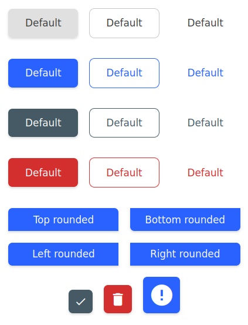

# @hdoc/react-button

<p align="center">
  <a href="https://www.npmjs.com/package/@hdoc/react-button">
    
  </a>
  
  
</p>

Simple button components for your React app



## Installation

```bash
npm install @hdoc/react-button @hdoc/react-material-icons @material-design-icons/font
```

## Usage

Import `@material-design-icons/font` in your entry file (example: src/main.jsx in Vite):

```js
import "@material-design-icons/font";
```

Check [@material-design-icons/font docs](https://www.npmjs.com/package/@material-design-icons/font#usage) for more info.

Then, in your `App.jsx` or another file:

```jsx
import { Button, ButtonIcon } from "@hdoc/react-button";

function App() {
  return (
    <>
      ...
      <Button size="large" color="primary" />
      <ButtonIcon icon="favorite" color="danger" />
    </>
  );
}
```

## API

See documentation below for reference to all of the props and classes available for the following components:

- [`<Button />`](docs/Button.md)
- [`<ButtonIcon />`](docs/ButtonIcon.md)

## Customization

You can customize the color of the button by using the following CSS custom properties:

```css
.any-parent-of-button-component,
.class-that-i-use-for-extending-styles {
  /* NORMAL BUTTON */
  --button-bg: lightgray;
  --button-bg-hover: darkgray;
  --button-bg-disabled: gray;
  --button-color: black;
  --button-color-disabled: white;
  --button-font-family: "Arial";
  --button-font-weight: bold;
  --button-padding: 10px;
  --button-radius: 10px;
  --button-shadow: 0 0 0 1px black;

  /* COLOR VARIANTS: primary | secondary | danger */
  --primary: blue; /* background and outline color */
  --primary-hover: darkblue;
  --primary-text: white;
  --primary-transparent: rgba(0, 0, 255, 0.1);

  /* OUTLINE AND TEXT VARIANTS */
  --button-outline-color: white; /* border and font color */
  --button-outline-bg-hover: black;
}
```
