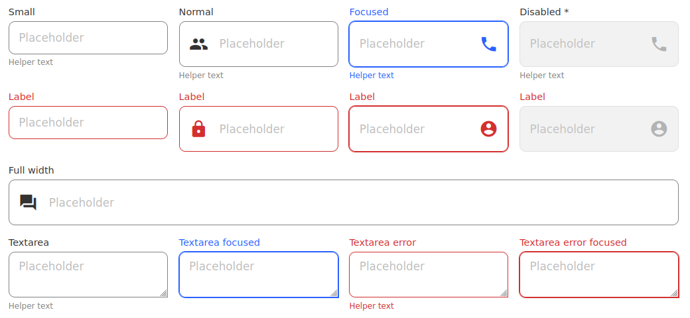

# @hdoc/react-input

<p align="center">
  <a href="https://www.npmjs.com/package/@hdoc/react-input">
    
  </a>
  
  
</p>

Simple input component for your React app



## Installation

```bash
npm install @hdoc/react-input @hdoc/react-material-icons @material-design-icons/font
```

## Usage

Import `@material-design-icons/font` in your entry file (example: src/main.jsx in Vite):

```js
import "@material-design-icons/font";
```

> :information_source: Check [@material-design-icons/font docs](https://www.npmjs.com/package/@material-design-icons/font#usage) for more info.

Then, in your `App.jsx` or another file:

```js
import { Input } from "@hdoc/react-input";

function App() {
  return (
    <>
      ...
      <Input label="Email" type="email" iconEnd="email" />
    </>
  );
}
```

## Props

All props are optional unless otherwise specified.
Additionally it can receive all attribues of an `input` element.

`size`

Size variant of the input.

Type: `'small'`

---

`error`

Whether the input has an error.

Type: `boolean`

---

`fullWidth`

Whether the input is full width, i.e., it takes up the full width of the parent.

Type: `boolean`

---

`iconStart`

The name of the icon to display on the left.

Type: `string`

---

`iconEnd`

The name of the icon to display on the right.

Type: `string`

---

`iconVariant`

The variant of the icon.

Type: `'filled' | 'outlined' | 'sharp' | 'two-tone'`

---

`className`

Additional class names for extending styles.

Type: `string`

---

`label`

The label of the input.

Type: `string`

---

`labelClassName`

Additional class names for extending styles of the label.

Type: `string`

---

`helperText`

The helper text of the input.

Type: `string`

## Customization

You can customize the color of the input by using the following CSS custom properties:

```css
/* YOU CAN USE ANY SELECTOR YOU WANT */
:root,
[data-theme="my-custom-theme"],
body.dark,
.any-parent-of-input,
.class-to-extend-styles {
  /* NORMAL INPUT */
  --input-bg: #ffffff;
  --input-bg-disabled: #aaa;
  --input-border-color: #888;
  /* auto-setted by --label-text */
  --input-border-color-hover: #444;
  /* auto-setted by --label-text-focus */
  --input-border-color-focus: lightblue;
  --input-border-color-disabled: rgba(0, 0, 0, 0.26);
  --input-text: #000;
  --input-helper-text: #828282;

  --placeholder-color: #636363;
  --placeholder-disabled: #434343;

  --label-text: #828282;
  --label-text-hover: #000;
  --label-text-focus: lightblue;

  /* ERROR VARIANT */
  /* auto-used by input, label and helper text */
  --error: #f44336;
}
```

## CSS classes

`.input`

The base styles for the input

---

`.input--error`

The error styles for the input

---

`.input-with-icon-start`

The styles for the input with an icon on the left

---

`.input-with-icon-end`

The styles for the input with an icon on the right

---

`.input--small`

The small styles for the input

---

`.input--fullwidth`

The full width styles for the input

---

`.input-label`

The styles for the label of the input

---

`.input-label--error`

The error styles for the label of the input

---

`.input-label--fullwidth`

The full width styles for the label of the input

---

`.input-helper-text`

The styles for the helper text of the input

---

`.input-icon`

The styles for the icon of the input

---

`.input-icon--start`

The styles for the icon of the input on the left

---

`.input-icon--end`

The styles for the icon of the input on the right
