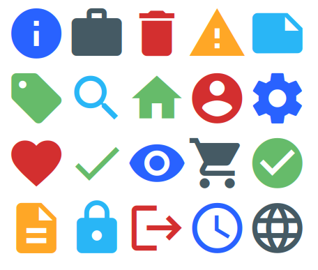

# @hdoc/react-material-icons

<p align="center">
  <a href="https://www.npmjs.com/package/@hdoc/react-material-icons">
    
  </a>
  
  
</p>

Simple component for material design icons in your React app.



## Installation

```bash
npm install @hdoc/react-material-icons @material-design-icons/font
```

## Usage

Import `@material-design-icons/font` in your entry file (example: src/main.jsx in Vite):

```js
import "@material-design-icons/font";
```

> :information_source: Check [@material-design-icons/font docs](https://www.npmjs.com/package/@material-design-icons/font#usage) for more info.

Then, in your `App.jsx` or another file:

```js
import { Icon } from "@hdoc/react-material-icons";

function App() {
  return (
    <>
      ...
      <Icon name="shopping_cart" size="large" variant="outlined" />
    </>
  );
}
```

## Props

**All props are optional unless otherwise specified.**

`name` **(required)**

The name of the icon.

Type: `string`

---

`color`

The color of the icon.

Type: `'primary' | 'secondary' | 'error' | 'warning' | 'info' | 'success'`

---

`className`

Additional class names for extending styles.

Type: `string`

---

`disabled`

Whether the icon is disabled.

Type: `boolean`

---

`size`

Font size for the icon.

Type: `'small' | 'large'`

---

`variant`

Variant of the icon.

Type: `'outlined' | 'round' | 'sharp' | 'two-tone'`

## Customization

You can customize the color and size of the icon by using the following CSS custom properties:

```css
.any-parent,
.class-to-extend-styles {
  --icon-color: black; /* default color */
  --icon-color-disabled: gray;

  --icon-size: 24px; /* default size */
  --icon-small: 18px;
  --icon-large: 36px;

  /* COLOR VARIANTS */
  --primary: lightblue;
  --secondary: lightpink;
  --error: red;
  --warning: orange;
  --info: blue;
  --success: green;
}
```

## CSS classes

`.material-icons`

The base styles for the icon

---

`.material-icons-outlined`

Styles for the outlined variant

---

`.material-icons-round`

Styles for the round variant

---

`.material-icons-sharp`

Styles for the sharp variant

---

`.material-icons-two-tone`

Styles for the two-tone variant

---

`.material-icons--small`

Styles for the small size

---

`.material-icons--medium`

Styles for the medium size

---

`.material-icons--large`

Styles for the large size

---

`.material-icons--disabled`

Styles for the disabled state

---

`.material-icons--primary`

Styles for the primary color variant

---

`.material-icons--secondary`

Styles for the secondary color variant

---

`.material-icons--error`

Styles for the error color variant

---

`.material-icons--warning`

Styles for the warning color variant

---

`.material-icons--info`

Styles for the info color variant

---

`.material-icons--success`

Styles for the success color variant
